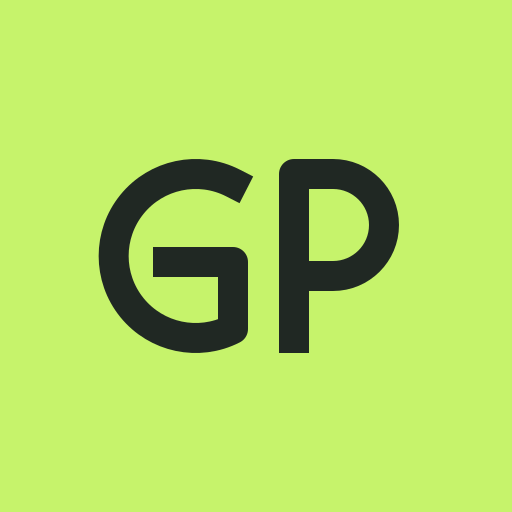
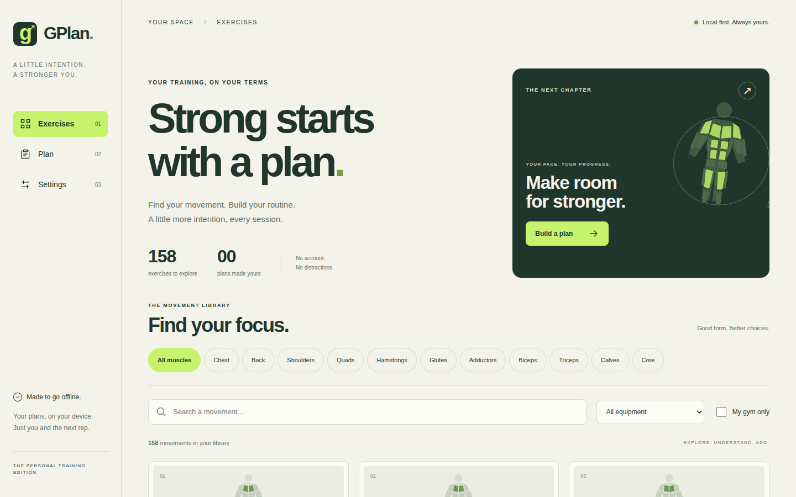
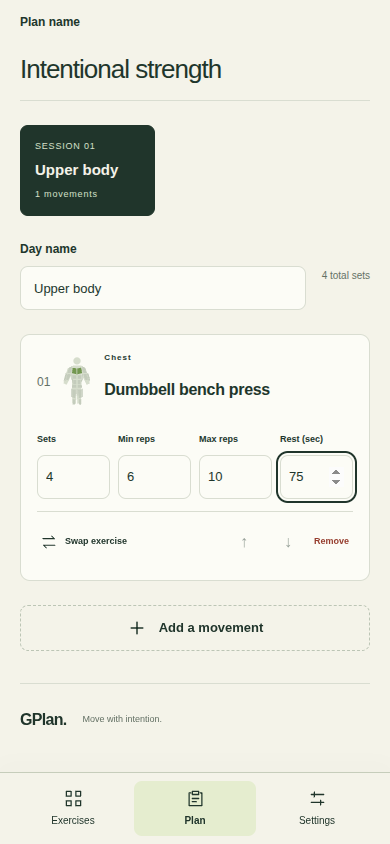
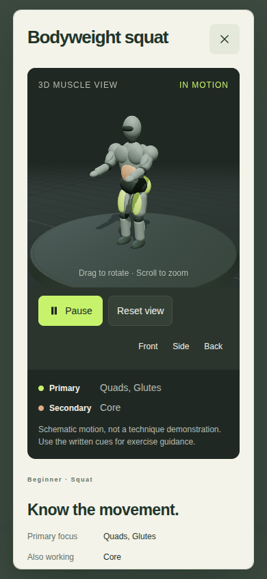

<p align="center">
  
</p>

<h1 align="center">GPlan</h1>

<p align="center"><strong>Your gym. Your plan. Even offline.</strong></p>

<p align="center">
  A personal training journal that helps you choose your movements,<br>
  build your routine, and keep going when the gym Wi-Fi doesn't.
</p>

<p align="center">
  <a href="#your-next-session-starts-here">Features</a> &middot;
  <a href="#a-gym-companion-that-fits-your-phone">Screenshots</a> &middot;
  <a href="#get-started">Get started</a> &middot;
  <a href="#your-choice-of-ai">AI support</a>
</p>



## Your next session starts here

GPlan brings your exercise library, equipment choices, and workout plans into one
mobile-friendly app. No account to create. No cloud sync to depend on. Your
training journal stays on your device.

| Built for your training | What you can do |
| --- | --- |
| **158 exercises. 11 muscle groups.** | Find movements by name, muscle focus, equipment, and what's available at your gym. |
| **A plan you can make your own** | Generate a local routine or start from a blank session. Edit days, movements, sets, reps, timed holds, and rest. |
| **Machine taken? Keep moving.** | Choose available alternatives ranked by shared primary muscles and movement pattern. |
| **See the muscles at work** | Explore local 3D schematics with muscle highlights, motion playback, and camera controls. |
| **Ready when the network isn't** | Install GPlan as a PWA. Browse, plan, edit, and view exercises offline after the first online load. |
| **AI when you want it** | Bring a Gemini key or an OpenAI-compatible provider, discover models, and review a suggested plan before saving it. |

## A gym companion that fits your phone

<table>
  <tr>
    <th>Your session, down to the last rep</th>
    <th>A closer look at each movement</th>
  </tr>
  <tr>
    <td align="center">
      
    </td>
    <td align="center">
      
    </td>
  </tr>
</table>

These are screenshots of the running application. The 3D view above was opened
offline, with its graphics loaded from the app's local cache.

### From an idea to a session

1. **Set up your gym.** Choose the machines, free weights, and other equipment you can use.
2. **Find your focus.** Explore the library or create a routine around your muscle groups and experience.
3. **Make it yours.** Adjust prescriptions and swap exercises when equipment or preferences change.
4. **Take it with you.** Install the app and keep your saved plan available on the gym floor.

## Local by default

Your plans and gym preferences are saved in your browser. Export a JSON backup
to keep a copy or move your journal to another device.

- **No account or application backend required.**
- **Core planning works without an AI connection.**
- **API keys stay in tab memory**, not saved storage or backups. Reloading clears them.
- **Updates wait for you.** Save your edits, then choose **Update and reload**.

Browser data is device-specific: clearing it removes your saved journal.
Export a backup first.

## Your choice of AI

Use AI as an optional planning assistant, not a requirement for training.

| Provider | Setup |
| --- | --- |
| **Google Gemini** | Enter your API key, discover generation models, and select one. Manual model IDs are supported too. |
| **OpenAI-compatible** | Enter an API root such as `https://api.openai.com/v1` or `http://localhost:1234/v1`, then discover models or enter an ID manually. |

GPlan sends your training request and eligible exercise metadata directly to the
selected provider. Suggestions are validated and shown as a preview; **you choose
whether to accept them**. Invalid responses leave your saved plans intact.

AI requires connectivity and a provider that permits browser requests through
CORS. Remote API roots must use HTTPS; localhost HTTP is supported, subject to
browser network policy. Compatible servers use `/models` and `/chat/completions`;
servers without authentication can use an empty key. Provider usage charges, if
any, are handled by your provider.

## Get started

You'll need [Bun](https://bun.sh).

```sh
git clone https://github.com/KNN-07/GPlan.git
cd GPlan
bun install --frozen-lockfile
bun run build
bun run preview
```

Open **http://localhost:4173**. Wait for **Ready offline** in Settings before
disconnecting.

### Install on your phone

- **iPhone or iPad:** open the deployed app in Safari, then **Share > Add to Home Screen**.
- **Android or desktop:** choose **Install GPlan** when offered, or use your browser's install menu.

Installation and service workers require HTTPS or localhost. To use GPlan on
another device, deploy `dist/` at the root of an HTTPS origin. The first online
visit caches the application; subsequent core use can be offline.

### Develop locally

```sh
bun run dev
```

The development server is for editing; use the production build and preview to
test installation and offline behavior.

## Built and verified

React, TypeScript, Vite, Three.js / React Three Fiber, and `vite-plugin-pwa`.
Exercise data and visualization assets are bundled locally.

The verified baseline includes **211 unit tests** and **5 production-browser
scenarios** covering saved swaps, cold offline 3D loading, responsive layouts,
both AI adapters, error handling, and key-free backups.

```sh
bun run typecheck
bun run test
bun run build
bunx playwright install chromium
bun run test:e2e
```

`bun test` also runs the complete Vitest suite. To use an already-installed Chrome,
set `PLAYWRIGHT_CHROMIUM_EXECUTABLE_PATH` to its executable.
See the [verification evidence](.omo/evidence/lead-final.md) for results and screenshots.
AI integration is tested with HTTP fixtures; live provider availability and
answer quality require your own credentials.

The 3D views are procedural muscle and motion schematics, not recorded GIFs or
technique-accurate demonstrations. Unsupported motions use static views.
Exercise substitutions share training targets but are not biomechanically identical.
